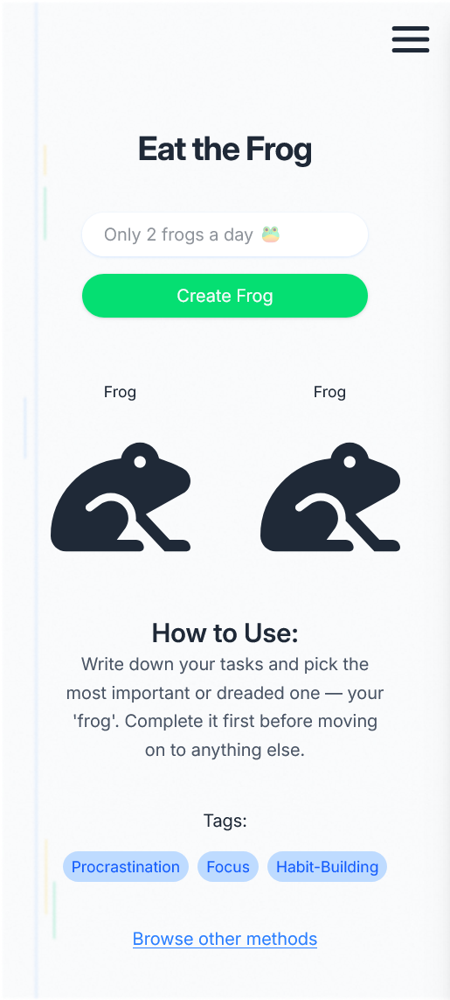
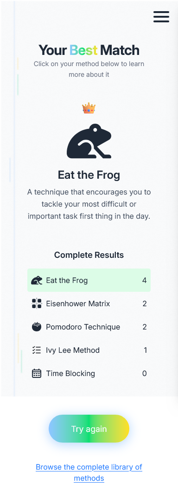

# Interactive Productivity Methods

An interactive React + TypeScript project where users take a short test to find the productivity method (Eat the Frog, Eisenhower Matrix, etc.) that suits them best, and then practice it through interactive tools. Designed and developed from scratch — UI/UX, logic, and components.


Live Demo: [Vercel](https://interactive-productivity-methods.vercel.app/)

## Features

- Personality-like test with a point-based system that suggests the most suitable productivity method
- Detailed results with scores for each method
- Interactive productivity tools:
  - ✅ Eat the Frog (enforces a strict limit of 2 tasks and uses default text logic via the reusable task hook)
  - ✅ Eisenhower Matrix (tasks are categorized into 4 quadrants, with persistence and dynamic urgency assignment)
  - ✅ Pomodoro Timer Pomodoro Timer (features a custom CSS visual dial that rotates to represent remaining time)
  - ✅ Ivy Lee Method (enforces a strict limit of 6 tasks and uses a non-shifting, auto-incrementing order ID for permanent prioritization)
  - ✅ Time Blocking (interactive timeline that uses calculated minute-to-pixel positioning and prevents time slot overlaps with validation logic)
- LocalStorage support: tasks stay saved between sessions
- Responsive UI (mobile + desktop)

## Tech stack

- [Vite](https://vitejs.dev/) + [React](https://react.dev/)
- [TypeScript](https://www.typescriptlang.org/)
- [Tailwind CSS](https://tailwindcss.com/) for styling
- [React Router](https://reactrouter.com/) for navigation
- [Vitest](https://vitest.dev/) for testing

## Design

All UI/UX design was created by me from scratch using [Figma](https://figma.com).  
The project demonstrates both coding and design skills.

## Installation and tests

1. Clone the repository

```bash
git clone https://github.com/soylltari/interactive-productivity-methods.git
```

2. Navigate to the project directory

```bash
cd interactive-productivity-methods
```

3. Install dependencies

```bash
npm install
```

4. Start the application

```bash
npm run dev
```

5. Open [http://localhost:5173](http://localhost:5173) in your browser

Run the test suite:

```bash
npm test
```

## Deployment

Deployed with Vercel. CI/CD auto-builds on push to main branch.

## What I Learned

- Project Architecture & Setup — built the project from scratch: planned feature flow, created reusable UI components, organized routes and state logic, and implemented a scalable folder structure.
- React Hooks — practiced `useState` and `useEffect`, and created a custom hook `useLocalStorage` and the reusable `useTaskManagement`.
- Advanced State Management — designed and implemented a generic custom hook (`useTaskManagement`) to standardize core logic across five different productivity methods, handling varied business rules (max limits, default values, urgency).
- Local Storage — learned how to persist user data in a simple web application.
- TypeScript Integration — migrated the project from JavaScript to TypeScript, adding type safety to components, custom hooks, and state structures.
- Responsive Design — built consistent UI using a mobile-first approach with Tailwind CSS.
- CSS Geometry & Animations — used pure CSS techniques (translateX/rotate and transform-origin with specific coordinates) to create responsive timeline and dynamic dial visuals.
- Component Testing — wrote tests with Vitest and React Testing Library.

## Future Improvements

- [x] Add remaining productivity tools:
  - [x] Eisenhower Matrix
  - [x] Pomodoro Timer
  - [x] Ivy Lee Method
  - [x] Time Blocking
- [ ] Add more productivity methods (Getting Things Done, Kanban, etc.)
- [ ] Add dark mode
- [ ] Improve UI/UX design

## Screenshots

#### Desktop


#### Mobile

| Eat the Frog                                                            | Result Page                                                              |
| ----------------------------------------------------------------------- | ------------------------------------------------------------------------ |
|  |  |
